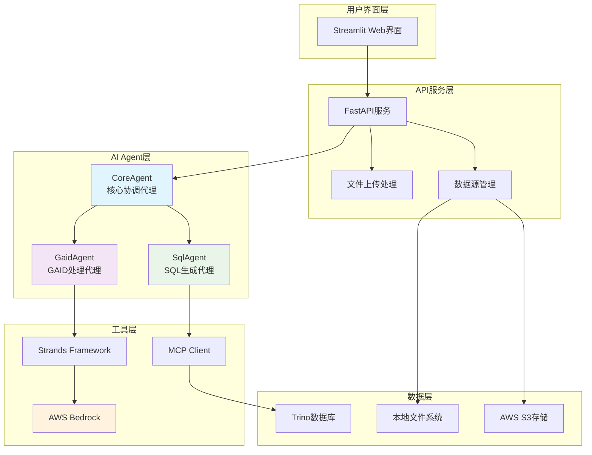

# 📊 广告投放数据洞察系统 (Ads Data Insight)

一个基于 AI Agent 的智能广告投放数据分析系统，能够自动处理 GAID 数据并生成精准的 SQL 查询，为广告投放效果分析提供深度洞察。

## 🚀 项目功能

### 核心功能
- **智能 GAID 处理**: 自动从 CSV 文件中提取 GAID 数据，根据数据量智能选择处理策略
- **自动 SQL 生成**: 基于用户需求自动生成复杂的 Trino SQL 查询语句
- **多数据源支持**: 支持本地文件、S3 存储等多种数据源
- **实时数据分析**: 连接 Trino 数据库进行实时数据查询和分析
- **可视化界面**: 提供友好的 Streamlit Web 界面

### 业务场景
- 广告投放效果分析
- 用户转化路径追踪
- 渠道效果对比分析
- 事件数据深度挖掘

## 🏗️ 技术架构

### 架构概览
```
┌─────────────────┐    ┌─────────────────┐    ┌─────────────────┐
│   前端界面      │    │   API 服务层    │    │   AI Agent层    │
│  (Streamlit)    │◄──►│   (FastAPI)     │◄──►│  (Multi-Agent)  │
└─────────────────┘    └─────────────────┘    └─────────────────┘
                                │                       │
                                ▼                       ▼
                       ┌─────────────────┐    ┌─────────────────┐
                       │   文件存储      │    │   数据库连接    │
                       │  (Local/S3)     │    │    (Trino)      │
                       └─────────────────┘    └─────────────────┘
```

### 核心组件

#### 1. AI Agent 层
- **CoreAgent**: 核心协调代理，负责整体工作流程编排
- **GaidAgent**: GAID 数据处理专家，负责数据提取和预处理
- **SqlAgent**: SQL 生成专家，负责复杂查询语句生成

#### 2. API 服务层
- **FastAPI**: 高性能异步 Web 框架
- **多种数据源支持**: 文件上传、本地路径、S3 存储
- **RESTful API**: 标准化的接口设计

#### 3. 数据处理层
- **Trino 连接**: 高性能分布式 SQL 查询引擎
- **MCP 协议**: Model Context Protocol 支持
- **数据缓存**: 智能数据缓存机制

#### 4. 前端展示层
- **Streamlit**: 快速构建数据应用界面
- **响应式设计**: 支持多设备访问
- **实时反馈**: 处理状态实时显示

## 📋 架构图



## 🛠️ 技术栈

### 后端技术
- **Python 3.8+**: 主要开发语言
- **FastAPI**: 现代化 Web 框架
- **Strands**: AI Agent 开发框架
- **AWS Bedrock**: 大语言模型服务
- **Trino**: 分布式 SQL 查询引擎
- **MCP**: Model Context Protocol

### 前端技术
- **Streamlit**: 数据应用快速开发框架
- **HTML/CSS**: 界面美化

### 数据处理
- **Pandas**: 数据处理和分析
- **CSV**: 数据文件格式
- **Boto3**: AWS SDK

### 部署运维
- **Uvicorn**: ASGI 服务器
- **Docker**: 容器化部署（可选）
- **Shell Scripts**: 自动化脚本

## 📦 安装部署

### 环境要求
- Python 3.8 或更高版本
- 可访问的 Trino 数据库
- AWS 账户（用于 Bedrock 服务）

### 安装步骤

1. **克隆项目**
```bash
git clone <repository-url>
cd ads-data-insight
```

2. **安装依赖**
```bash
pip install -r requirements.txt
```

3. **配置数据库连接**
编辑 `config/trino_config.py` 文件：
```python
TRINO_CONFIG = {
    "TRINO_HOST": "your-trino-host",
    "TRINO_PORT": "8889", 
    "TRINO_USER": "your-username"
}
```

4. **配置 AWS 凭证**
```bash
export AWS_ACCESS_KEY_ID=your-access-key
export AWS_SECRET_ACCESS_KEY=your-secret-key
export AWS_DEFAULT_REGION=us-east-1
```

## 🚀 使用方法

### 启动服务

#### 方法一：使用脚本启动
```bash
# 启动后端 API 服务
./start_api.sh

# 启动前端界面（新终端）
./start_frontend.sh
```

#### 方法二：手动启动
```bash
# 启动后端服务
python app.py

# 启动前端服务
streamlit run frontend/app.py --server.port 8501 --server.address 0.0.0.0
```

### 访问应用
- **前端界面**: http://localhost:8501
- **API 文档**: http://localhost:8000/docs

### 使用流程

1. **访问 Web 界面**
   - 打开浏览器访问 http://localhost:8501

2. **输入工单内容**
   ```
   1. 包名:com.example.social
   2. 事件名称:install
   3. 时间周期:20250701-20250811
   4. gaid:
   ```

3. **上传 GAID 文件**
   - 支持 CSV 格式文件
   - 文件应包含 gaid 列

4. **提交分析请求**
   - 点击"提交"按钮
   - 系统自动处理并生成结果

5. **下载分析结果**
   - 系统生成 CSV 格式的分析报告
   - 点击下载链接获取结果

### API 使用示例

#### 文件上传方式
```bash
curl -X POST "http://localhost:8000/data-query/upload-file" \
  -F "user_input=包名:com.example.social 事件名称:install 时间周期:20250701-20250811" \
  -F "file=@your-gaid-file.csv"
```

#### 文件路径方式
```bash
curl -X POST "http://localhost:8000/data-query/file-path" \
  -F "user_input=包名:com.example.social 事件名称:install 时间周期:20250701-20250811" \
  -F "file_path=/path/to/your/file.csv"
```

#### S3 路径方式
```bash
curl -X POST "http://localhost:8000/data-query/s3-path" \
  -F "user_input=包名:com.example.social 事件名称:install 时间周期:20250701-20250811" \
  -F "s3_path=s3://your-bucket/your-file.csv"
```

## 📊 数据表结构

系统支持以下数据表查询：

### t_conversion1 (安装转化表)
- `dt`: 日期
- `pkg_name`: 包名
- `second_channel`: 二级渠道
- `affiliate_id`: 联盟ID
- `nation`: 国家
- `gaid`: Google 广告ID

### t_conversion2 (拒绝转化表)
- 字段结构同 t_conversion1

### t_event (事件表)
- `dt`: 日期
- `pkg_name`: 包名
- `second_channel`: 二级渠道
- `affiliate_id`: 联盟ID
- `nation`: 国家
- `event_name`: 事件名称
- `gaid`: Google 广告ID

## 🔧 配置说明

### 日志配置
系统使用结构化日志记录，配置文件位于 `config/logger_config.py`

### 数据库配置
Trino 连接配置位于 `config/trino_config.py`

### MCP 服务器配置
SQL Agent 使用 MCP 协议连接 Trino，配置路径：`/data/mcp-trino-python/src/server_stdio.py`

## 🧪 测试

### 运行测试
```bash
# API 测试
python test_api_client.py

# 功能测试
python test.py
```

### 测试脚本
- `test_api_client.py`: API 接口测试
- `test.py`: 核心功能测试

## 📝 开发指南

### 项目结构
```
ads-data-insight/
├── agent/              # AI Agent 模块
│   ├── core_agent.py   # 核心协调代理
│   ├── gaid_agent.py   # GAID 处理代理
│   └── sql_agent.py    # SQL 生成代理
├── api/                # API 服务模块
│   ├── main.py         # FastAPI 主应用
│   └── data_query.py   # 数据查询路由
├── config/             # 配置模块
│   ├── logger_config.py # 日志配置
│   └── trino_config.py  # 数据库配置
├── frontend/           # 前端界面
│   └── app.py          # Streamlit 应用
├── data/               # 数据文件目录
├── output/             # 输出结果目录
└── requirement/        # 需求文档
```

### 扩展开发
1. **添加新的 Agent**: 在 `agent/` 目录下创建新的代理类
2. **扩展 API**: 在 `api/data_query.py` 中添加新的路由
3. **自定义界面**: 修改 `frontend/app.py` 添加新功能

## 🤝 贡献指南

1. Fork 项目
2. 创建功能分支 (`git checkout -b feature/AmazingFeature`)
3. 提交更改 (`git commit -m 'Add some AmazingFeature'`)
4. 推送到分支 (`git push origin feature/AmazingFeature`)
5. 开启 Pull Request

## 📄 许可证

本项目采用 MIT 许可证 - 查看 [LICENSE](LICENSE) 文件了解详情

## 📞 联系方式

如有问题或建议，请通过以下方式联系：
- 提交 Issue
- 发送邮件至项目维护者

## 🙏 致谢

感谢以下开源项目的支持：
- [FastAPI](https://fastapi.tiangolo.com/)
- [Streamlit](https://streamlit.io/)
- [Strands](https://github.com/strands-ai/strands)
- [AWS Bedrock](https://aws.amazon.com/bedrock/)
- [Trino](https://trino.io/)

---

**注意**: 请确保在生产环境中妥善配置安全设置和访问控制。